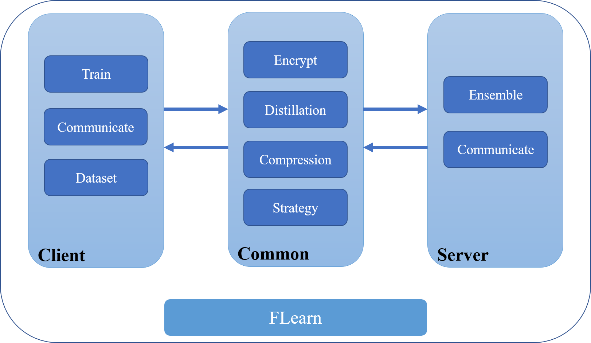
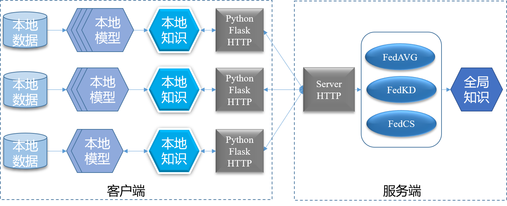

## 联邦学习框架

### Quickstart

1. 下载最新的[release版本](https://github.com/wnma3mz/flearn/releases/latest) 并使用pip安装。或手动下载源码，在当前目录进行编译 `python setup.py sdist bdist_wheel`。
2. 切换至运行目录 `cd example/mnist_cifar/`
3. 运行 `python main.py --strategy_name avg --dataset_name mnist dataset_fpath 数据集路径`

详细解释见 `example/mnist_cifar`中的[README.md](https://github.com/wnma3mz/flearn/tree/master/example/mnist_cifar)

### 进阶1——复现LG-FedAVG

- 修改 `Client.py`，以及如何配置共享层

见[README.md](https://github.com/wnma3mz/flearn/tree/master/example/LG_reproduction)

### 进阶2——复现FedProx

- 修改训练器，以运用至更多任务与模型

见[README.md](https://github.com/wnma3mz/flearn/tree/master/example/Prox)

### 进阶3——复现FedPAV

- 修改客户端以及服务器端，以适用于FedPAV策略

见[README.md](https://github.com/wnma3mz/flearn/tree/master/example/PAV_reproduction)

### 支持策略

- [X] FedSGD
- [X] FedAVG
- [X] FedAVGM
- [X] FedBN
- [X] LG-FedAVG
- [X] FedOPT
- [X] FedPAV
- [ ] 复现计划
  - [X] FedDistill
  - [X] FedDyn
  - [X] FedMD
  - [X] FedMutual
  - [X] MOON
  - [X] CCVR
  - [X] FedGen
  - [X] FedDF(Ensemble Distillation)
  - [ ] FedNova

split-learning可见[README.md](https://github.com/wnma3mz/flearn/tree/master/example/split_learning)，尚存在loss爆炸问题。

### 框架图

### 工作流

