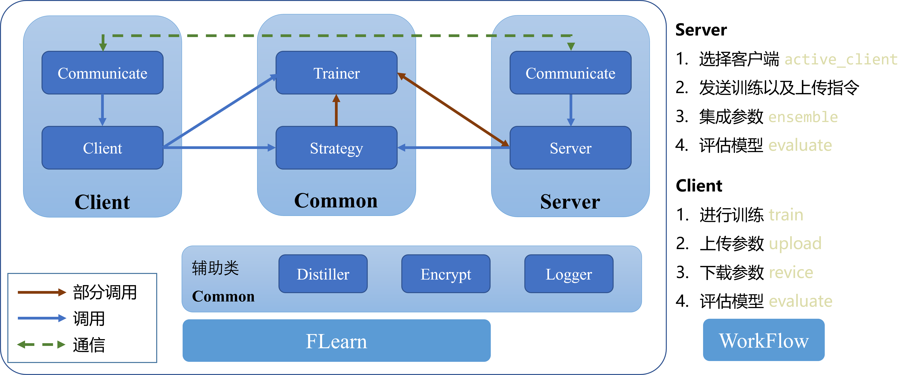

## 联邦学习框架

### Quickstart

1. 下载最新的[release版本][https://github.com/wnma3mz/flearn/releases/latest] 并使用pip安装
2. 切换至运行目录`cd example/mnist_cifar/`
3. 运行`python main.py --strategy_name avg --dataset_name mnist dataset_fpath 数据集路径`

详细解释见`example/mnist_cifar`中的[README.md](https://github.com/wnma3mz/flearn/tree/master/example/mnist_cifar)

### 支持策略

- [x] FedSGD
- [x] FedAVG
- [x] FedAVGM
- [x] FedBN
- [x] LG-FedAVG
- [x] FedOPT
- [x] FedPAV

split-learning可见`example/split_learning`

### 框架图

### 工作流

